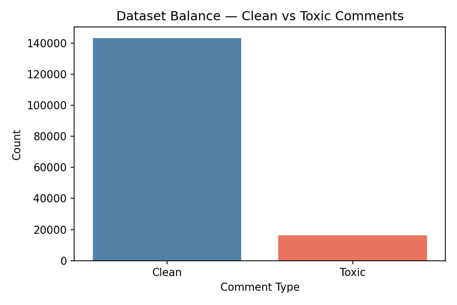
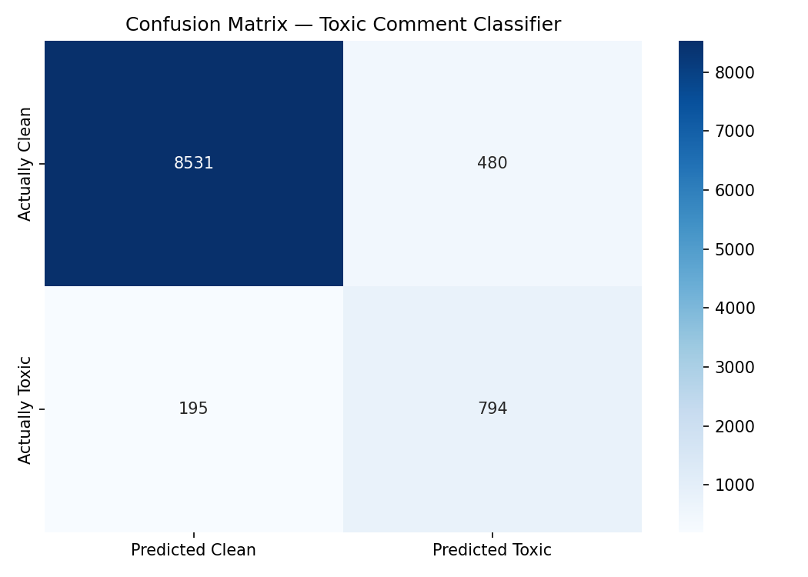
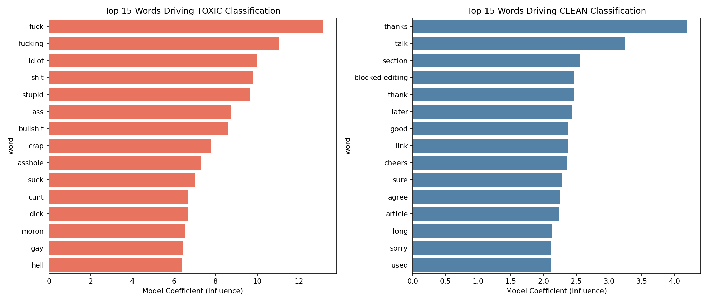

# Toxic Comment Classifier

A machine learning pipeline that detects toxic comments using the Jigsaw 
Toxic Comment Classification dataset. Built to demonstrate abuse detection 
techniques relevant to Trust & Safety analysis.

## What it does
- Loads and explores 159,571 real online comments (Jigsaw/Wikipedia dataset)
- Creates a unified toxicity label across 6 abuse categories
- Converts raw text to numerical features using TF-IDF vectorisation
- Trains a Logistic Regression classifier with class balancing
- Evaluates performance using accuracy, precision, recall and confusion matrix
- Identifies the top words driving toxic vs clean classifications
- Tests predictions on new comments in real time

## Results
- Overall Accuracy: ~93%
- Model performs strongly on explicit toxicity (profanity-based language)
- Implicit threats without profanity are harder to detect — e.g. "I will 
  find you and make you regret this" was classified as Clean (57% confidence)
- This reflects a known real-world limitation of keyword-based ML models
- False negatives (missed toxic comments) are the critical metric in 
  Trust & Safety — improvement path is BERT-based contextual models

## Key Insight for Trust & Safety
The confusion matrix reveals 195 false negatives out of 989 toxic test 
comments (19.7% miss rate). In a real platform context, these are the most 
dangerous errors — harmful content that slips through. This analysis 
demonstrates awareness of the trade-off between precision and recall in 
abuse detection systems.

## Sample Predictions
| Comment | Result | Confidence |
|---|---|---|
| "I really enjoyed this video!" | ✅ Clean | 89.3% |
| "You are an idiot and nobody likes you" | 🚨 Toxic | 99.8% |
| "I will find you and make you regret this" | ✅ Clean | 57.0% |

## Tools & Libraries
- Python, Pandas, Scikit-learn, Matplotlib, Seaborn
- TF-IDF Vectorisation (10,000 features, bigrams)
- Logistic Regression with class balancing
- Dataset: Jigsaw Toxic Comment Classification (Kaggle)

## Charts

